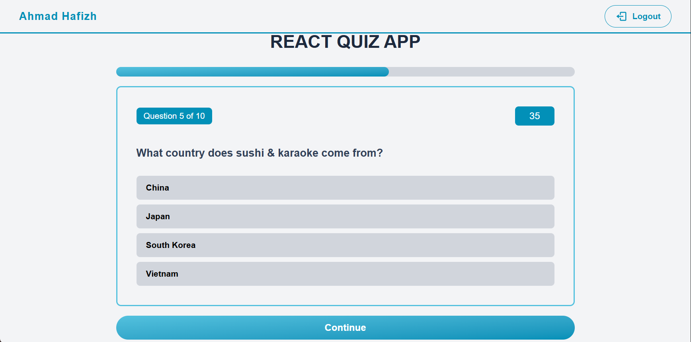

# 🎮 React Quiz App (with Auth & Routing)

React Quiz App is a **React**-based quiz application equipped with a **simple authentication system**, **routing using React Router**, and **game page protection**. Question data is retrieved in real time from the **Open Trivia Database API**.

---

## 📌 Application Link

🔗 [Try the Application Here](https://reactjs-mini-quiz-app.netlify.app)

---

## ✨ Key Features

- 🔐 **User authentication**
  - Sign Up & Sign In
  - User storage using `localStorage`
- 🔒 **Protected Route**
  - Game pages can only be accessed after logging in
- 🎯 Multiple choice quiz (10 questions)
- ⏱️ Timer with progress bar
- 📊 Score calculation & number of questions answered
- 🔀 Randomized answers for each question
- 🎨 Modern UI with Tailwind CSS
- 🔁 Restart game after completion

---

## 🛠️ Technology Used

- **React**
- **React Router DOM**
- **Axios**
- **Tailwind CSS**
- **Open Trivia Database API**
- **he** (HTML Entity Decoder)
- **LocalStorage**

---

## 📁 Folder Structure

```text
REACT-QUIZ-APP/
├── public/
├── src/
│   ├── components/
│   │   ├── Navbar.jsx
│   │   ├── Header.jsx
│   │   ├── StartScreen.jsx
│   │   ├── QuestionCard.jsx
│   │   └── GameOver.jsx
│   │
│   └── pages/
│   │   ├── Game.jsx
│   │   ├── SignIn.jsx
│   │   └── SignUp.jsx
│   │
│   ├── App.jsx
│   ├── main.jsx
│   ├── index.css
│   └── config.js
|
├── index.html
├── package.json
├── README.md
└── vite.config.js
```

---

## 🚀 Installing and Running the Application

1. **Clone Repository**
   ```bash
   git clone https://github.com/MFadhliAlHafizh/react-quiz-app
   ```

2. **Go to the project folder**
   ```bash
   git clone https://github.com/MFadhliAlHafizh/react-quiz-app
   cd react-quiz-app
   ```

3. **Install dependencies**
   ```bash
   npm install
   ```

4. **Run the application**
   ```bash
   npm run dev
   ```

5. **Open browser**
   ```bash
   http://localhost:5173
   ```

---

## 🎮 How to Play

1. Sign up for a new account
2. Sign in to the app
3. Click Let's Start
4. Answer the questions that appear
5. Each question can only be answered once
6. Click Continue to proceed
7. Once all questions are completed or time runs out, the Game Over page will appear
8. Click Restart to play again

---

## 🌐 APIs Used

Open Trivia Database
```
https://opentdb.com/api.php?amount=10&category=9&difficulty=easy&type=multiple
```

---

## 📸 Preview Interface

> 
